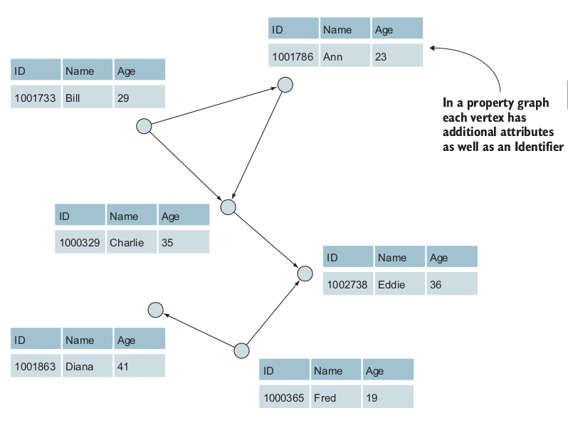
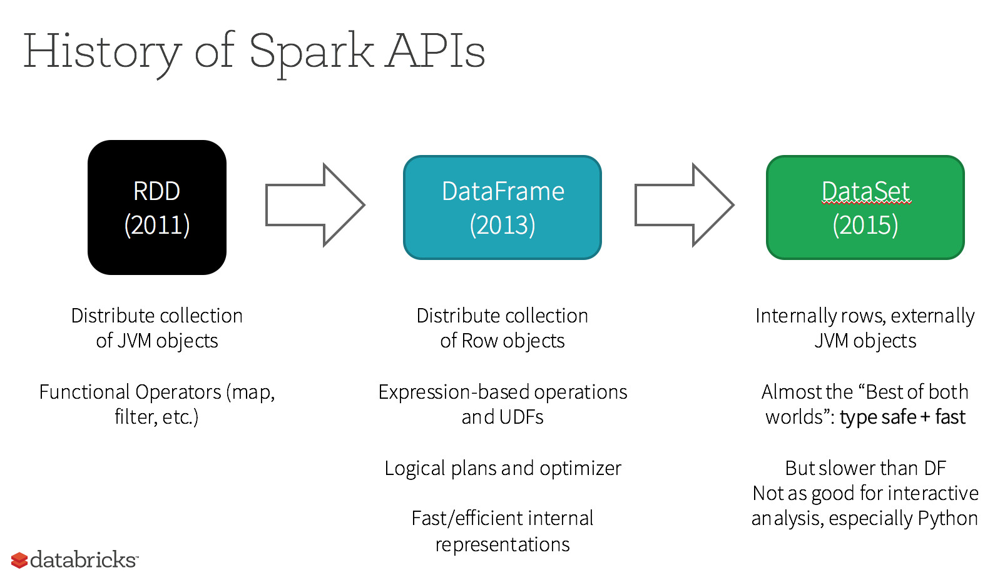

# GraphX
* GraphX là một framework của Spark ra đời nhằm giải quyết cái bài toán trên đồ thị với dữ liệu lớn.
* GraphX đơn giản có thể hiểu là "học lại môn Lý thuyết đồ thị nhưng với dữ liệu lớn. Vậy nên để sử dụng được GraphX, lập trình viên cần biết các kiến thức về Lý thuyết đồ thị.
* Ví dụ: các bài toán xếp hạng trang PageRank, các bài toán khám phá cộng đồng để tìm ra các đặc điểm chung của một nhóm.
* GraphX của Spark là một bước nhảy vọt so với Hadoop MapReduce bởi vì Hadoop lưu trữ các data distributed trên DISK - từ đây điểm yếu lộ ra là nó cần truy cập dữ liệu một cách tuần tự (do đĩa cần quay để đọc), còn với Spark nó lưu trữ trên RAM - có thể truy cập dữ liệu ngẫu nhiên tùy vào nhu cầu của hệ thống.
* GraphX được lập trình bằng ngôn ngữ Scala.
* GraphX không phải là một CSDL - nó là một **graph processing system** (tam dịch: hệ thống xử lý dữ liệu dạng đồ thị). Có thể liên tưởng việc ta giải một bài toán bằng GraphX như việc ta đang training một model machine learning.
* Vì GraphX không phải là một CSDL nên nó không thể thực hiện các tính năng điển hình là cập nhật, xóa như **Neo4j**, **Titan** - ở đây chúng là các **graph database** (CSDL đồ thị).
* Ngoài GraphX, ta còn có các graph processing system tương tự như **Apache Giraph** (của Hadoop và được Facebook sử dụng), **GraphLab**,... các framework này đều được lấy ý tưởng từ Google Pregel - cũng là một graph processing system.
* Các graph processing system như vậy hoạt động tốt cho dữ liệu lớn vì chúng có các thuật toán được xây dựng sẵn và có khả năng xử lí dữ liệu độc lập do tận dụng được ưu điểm của data distributed.

# Property Graph
* GraphX triển khai các đồ thị và tính toán của nó trên **property graph** (tạm dịch: đồ thị thuộc tính). 
* Property Graph vẫn có các đặc điểm cơ bản của một đồ thị như đỉnh và cạnh, nhưng lúc này các đỉnh có thể kèm theo các thuộc tính và các cạnh cũng có thể đi kèm theo các thuộc tính.
* Vậy nó lưu property graph này như thế nào, GraphX đại diện cho property graph bằng **hai RDD** - một dùng để lưu đỉnh và một dùng để lưu cạnh cùng các thuộc tính kèm theo của đỉnh và cạnh tương ứng.
* Hình này là cách GraphX dùng RDD để lưu thông tin các đỉnh (trang 16 cuốn GraphX in Action). Ở đây `ID` là do GraphX tự phát sinh, còn `Name` và `Age` là các thuộc tính được đính kèm theo đỉnh trong RDD.
  
* Hình này là cách GraphX dùng RDD lưu thông tin về các cạnh (trang 16 cuốn GraphX in Action). Có thể thấy hai thuộc tính `Src` và `Dest` là lưu thông tin **cạnh có hướng** nó còn lưu thêm thông tin là `Weight` - là một thuộc tính của cạnh.
  
* Khi một property graph được xử lí trên cluster. Thay vì chọn cách đơn giản chia đều các đỉnh cho từng node trong cluster, GraphX sẽ **chia theo cạnh**, người ta lí giải vì một đỉnh đôi khi sẽ có **degree** (bậc) rất cao, nên việc chia theo đỉnh sẽ khiến các cluster bị phân chia tài nguyên không công bằng bởi vì một node đôi khi phải xử lí quá nhiều cạnh. Khắc phục điều này nên GraphX chia theo cạnh. Hình dưới đây thể hiện sự mất cân bằng về degree của các đỉnh (lấy từ trang 17 cuốn GraphX in Action).
  

# GraphFrame, sự phát triển tiếp theo cũa GraphX
* GraphX là một framework tuyết vời để xử lí dữ liệu đồ thị, nhưng thuở ban đầu nó chỉ hỗ trợ cho duy nhất ngon ngữ dùng để lập trình cho nó chính là Scala - một ngôn ngữ không dễ để học với người mới bắt đầu.
* Lẽ đó, từ năm 2013, Spark công bố DataFrame, được phát triển lên từ RDD kéo theo đó họ cũng phát triển từ GraphX sang GraphFrame. Điểm khác biệt cơ bản của GraphX và GraphFrame là GraphX sử dụng RDD data distributed còn GraphFrame sử dụng DataFrame.
  

* Một trong những lợi ích lớn nhất của GraphFrame là nó hỗ trợ cho ba ngôn ngữ là Java, Python và kể cả Scala - ngôn ngữ mẹ đẻ của Spark.
* Một điều nữa, có thể dễ dàng biến đổi qua lại giữa RDD và DataFrame bằng phương thức `rdd` và `toDF` nằm trong framework tương ứng.
  